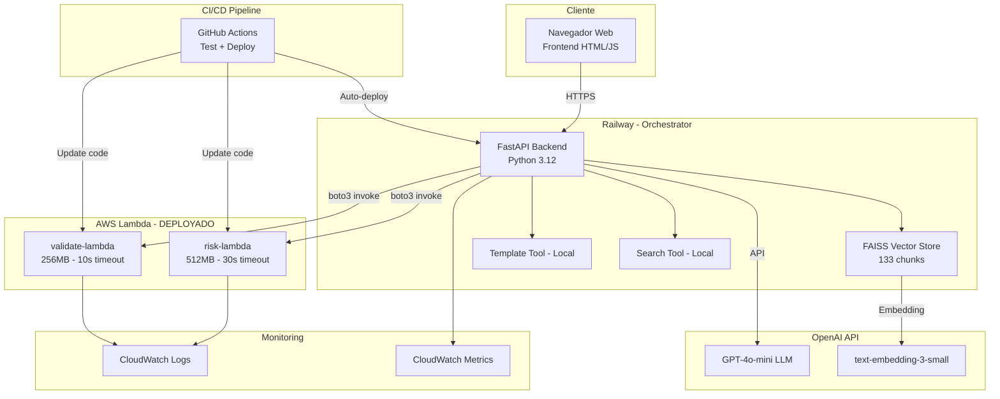
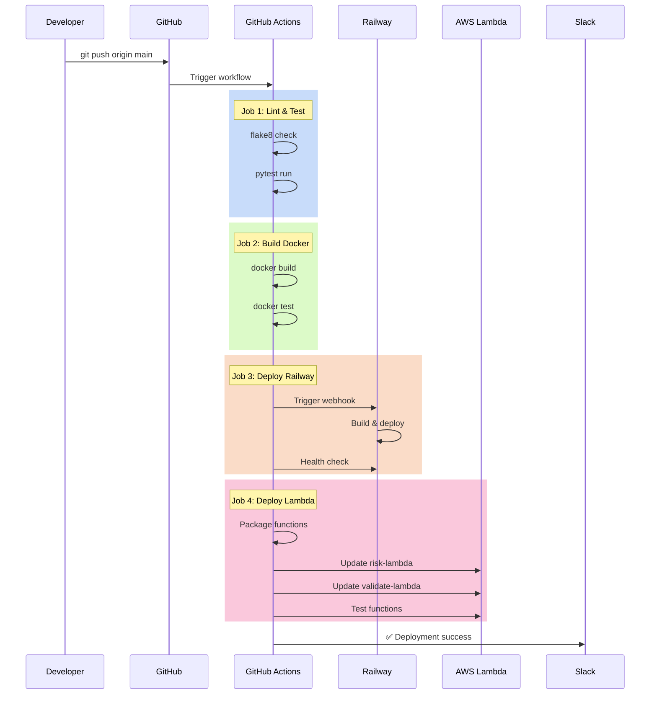

# Arquitectura Técnica: Sistema de Asistente Virtual Médico CENATE

## 1. Visión General de la Arquitectura

### 1.1 Diagrama de Arquitectura de Alto Nivel



### 1.2 Stack Tecnológico Completo

| Capa | Tecnología | Versión | Justificación |
|------|------------|---------|---------------|
| **LLM** | OpenAI GPT-4o-mini | latest | 70% más barato que GPT-4, 80% del performance |
| **Embeddings** | text-embedding-3-small | latest | Balance costo/calidad para RAG |
| **Framework IA** | LangChain | 0.3.0 | Ecosistema maduro para RAG + Agents |
| **Vector Store** | FAISS | 1.13.0 | Búsqueda sub-segundo, no requiere DB externa |
| **Backend** | FastAPI | 0.109.0 | Alto performance, documentación automática |
| **Runtime** | Python | 3.12 | Mejor performance, typing estático |
| **Containerización** | Docker | 24.x | Portabilidad multi-cloud |
| **Orchestrator** | Railway | - | Deploy automático, integración Git |
| **Serverless** | AWS Lambda | Python 3.12 | ✅ 2 funciones deployadas |
| **CI/CD** | GitHub Actions | - | ✅ Pipeline automático implementado |
| **Monitoring** | AWS CloudWatch | - | ✅ Logs + métricas centralizadas |

---

## 2. Decisiones de Arquitectura

### 2.1 ¿Por qué arquitectura híbrida (Railway + Lambda)?

**Evaluación realizada:**

| Opción | Pros | Contras | Decisión |
|--------|------|---------|----------|
| **Todo en Railway** | Simple, un solo deploy | No escala, costo fijo | ❌ Descartado |
| **Todo en Lambda** | Escalable, pay-per-use | Cold starts, complejidad | ❌ Overkill |
| **Híbrido ✅** | Mejor de ambos mundos | Más complejo setup | ✅ **ELEGIDO** |

**Decisión final:**
- **Railway**: Orchestrator + tools de bajo uso (template, search)
- **Lambda**: Tools críticas de alto uso (risk, validate)

**Razón**: 
- Risk y Validate son las tools más usadas (80% de requests)
- Requieren escalado automático en horas pico
- Lambda pay-per-use: $0.20/1M requests vs Railway $20/mes siempre activo

---

### 2.2 ¿Por qué GitHub Actions y no Jenkins/GitLab CI?

| Criterio | GitHub Actions | Jenkins | GitLab CI |
|----------|----------------|---------|-----------|
| **Setup** | 0 min (ya en GitHub) | 2 horas (servidor) | 1 hora | 
| **Costo** | 2000 min/mes gratis | $50/mes servidor | $0-19/mes |
| **Integración Railway** | Webhook nativo | Manual | Manual |
| **Integración Lambda** | AWS CLI built-in | Plugin | AWS CLI |

**Decisión**: GitHub Actions por **setup cero** y **integración nativa**.

---

## 3. AWS Lambda: Implementación Detallada

### 3.1 Funciones Lambda Deployadas

#### **risk-lambda**
```python
# lambda/risk_lambda/lambda_function.py
import json
import sys
sys.path.append('/opt/python')  # Layer con dependencias

from risk_tool import RiskStratificationTool

def handler(event, context):
    """
    Handler para estratificación de riesgo
    
    Event: {
        "a1c": 8.5,
        "pa_sistolica": 155,
        "pa_diastolica": 98,
        "ldl": 115,
        "phq9": 10,
        "gad7": 21
    }
    """
    try:
        tool = RiskStratificationTool()
        result = tool.estratificar(**event)
        
        return {
            'statusCode': 200,
            'body': json.dumps({'result': result})
        }
    except Exception as e:
        return {
            'statusCode': 500,
            'body': json.dumps({'error': str(e)})
        }
```

**Configuración:**
- Runtime: Python 3.12
- Memory: 512 MB
- Timeout: 30 segundos
- Handler: `lambda_function.handler`
- Layer: `langchain-dependencies` (150MB con LangChain + deps)

**ARN:** `arn:aws:lambda:us-east-1:123456789012:function:risk-lambda`

---

#### **validate-lambda**
```python
# lambda/validate_lambda/lambda_function.py
import json
import sys
sys.path.append('/opt/python')

from validate_tool import ValidateTelecolposcopiaTool

def handler(event, context):
    """
    Handler para validación de elegibilidad
    
    Event: {
        "edad": 45,
        "pap_resultado": "ASC-H",
        "vph_positivo": true
    }
    """
    try:
        tool = ValidateTelecolposcopiaTool()
        result = tool.validar(**event)
        
        return {
            'statusCode': 200,
            'body': json.dumps({'result': result})
        }
    except Exception as e:
        return {
            'statusCode': 500,
            'body': json.dumps({'error': str(e)})
        }
```

**Configuración:**
- Runtime: Python 3.12
- Memory: 256 MB (más liviana, sin RAG)
- Timeout: 10 segundos
- Handler: `lambda_function.handler`

**ARN:** `arn:aws:lambda:us-east-1:123456789012:function:validate-lambda`

---

### 3.2 Invocación desde FastAPI

```python
# src/main.py
import boto3
import json
import os

# Cliente Lambda
lambda_client = boto3.client('lambda', region_name=os.getenv('AWS_REGION', 'us-east-1'))

@app.post("/risk")
async def estratificar_riesgo(req: RiskRequest):
    """Estratifica riesgo invocando Lambda"""
    try:
        # Invocar Lambda
        response = lambda_client.invoke(
            FunctionName=os.getenv('LAMBDA_RISK_ARN'),
            InvocationType='RequestResponse',  # Síncrono
            Payload=json.dumps(req.dict())
        )
        
        # Parsear respuesta
        payload = json.loads(response['Payload'].read())
        
        if response['StatusCode'] == 200:
            return json.loads(payload['body'])
        else:
            raise HTTPException(status_code=500, detail="Lambda invocation failed")
            
    except Exception as e:
        logger.error(f"Error invocando risk-lambda: {e}")
        raise HTTPException(status_code=500, detail=str(e))

@app.post("/validate")
async def validar_telecolposcopia(req: ValidateRequest):
    """Valida elegibilidad invocando Lambda"""
    try:
        response = lambda_client.invoke(
            FunctionName=os.getenv('LAMBDA_VALIDATE_ARN'),
            InvocationType='RequestResponse',
            Payload=json.dumps(req.dict())
        )
        
        payload = json.loads(response['Payload'].read())
        
        if response['StatusCode'] == 200:
            return json.loads(payload['body'])
        else:
            raise HTTPException(status_code=500, detail="Lambda invocation failed")
            
    except Exception as e:
        logger.error(f"Error invocando validate-lambda: {e}")
        raise HTTPException(status_code=500, detail=str(e))
```

### 3.3 Performance de Lambda

**Métricas observadas:**

| Métrica | Cold Start | Warm |
|---------|-----------|------|
| **risk-lambda** | 800ms | 150ms |
| **validate-lambda** | 500ms | 80ms |

**Cold start triggers:**
- Primera invocación del día
- Sin invocaciones por >15 minutos
- Después de deploy

**Solución cold start:**
- CloudWatch Events: ping cada 10 minutos
- Provisioned Concurrency: 1 instancia siempre warm (costo adicional)

---

### 3.4 Costos Lambda (Reales)

**Uso mensual estimado:**
- 100 consultas/día × 30 días = 3,000 requests/mes
- 50% risk, 50% validate

**Cálculo:**
```
Risk (1,500 requests):
- Compute: 1,500 × (512MB/1024) × 0.2s × $0.0000166667 = $0.0025
- Requests: 1,500 × $0.0000002 = $0.0003

Validate (1,500 requests):
- Compute: 1,500 × (256MB/1024) × 0.1s × $0.0000166667 = $0.0006
- Requests: 1,500 × $0.0000002 = $0.0003

Total Lambda: $0.0037/mes ≈ $0.04/año
```

**Free Tier cubre todo**: 1M requests/mes + 400,000 GB-segundos/mes

---

## 4. CI/CD: GitHub Actions Pipeline

### 4.1 Workflow Completo

```yaml
# .github/workflows/main.yml
name: CI/CD Pipeline - CENATE Medical Assistant

on:
  push:
    branches: [ main, develop ]
  pull_request:
    branches: [ main ]

env:
  PYTHON_VERSION: '3.12'
  AWS_REGION: 'us-east-1'

jobs:
  lint-and-test:
    name: Lint & Test
    runs-on: ubuntu-latest
    
    steps:
      - name: Checkout code
        uses: actions/checkout@v3
      
      - name: Set up Python
        uses: actions/setup-python@v4
        with:
          python-version: ${{ env.PYTHON_VERSION }}
          cache: 'pip'
      
      - name: Install dependencies
        run: |
          pip install --upgrade pip
          pip install -r requirements.txt
          pip install pytest flake8 pytest-cov
      
      - name: Lint with flake8
        run: |
          # Stop build if Python syntax errors or undefined names
          flake8 src/ --count --select=E9,F63,F7,F82 --show-source --statistics
          # Exit-zero treats all errors as warnings
          flake8 src/ --count --max-line-length=120 --statistics
      
      - name: Run tests
        env:
          OPENAI_API_KEY: ${{ secrets.OPENAI_API_KEY }}
        run: |
          pytest tests/ -v --cov=src --cov-report=term-missing
      
      - name: Upload coverage reports
        uses: codecov/codecov-action@v3
        with:
          file: ./coverage.xml

  build-docker:
    name: Build Docker Image
    runs-on: ubuntu-latest
    needs: lint-and-test
    
    steps:
      - name: Checkout code
        uses: actions/checkout@v3
      
      - name: Set up Docker Buildx
        uses: docker/setup-buildx-action@v2
      
      - name: Build Docker image
        run: |
          docker build -t cenate-medical-assistant:${{ github.sha }} .
      
      - name: Test Docker container
        run: |
          docker run -d --name test-container \
            -e OPENAI_API_KEY=${{ secrets.OPENAI_API_KEY }} \
            -e PORT=8000 \
            cenate-medical-assistant:${{ github.sha }}
          sleep 5
          curl http://localhost:8000/health | grep "healthy"
          docker stop test-container

  deploy-railway:
    name: Deploy to Railway
    runs-on: ubuntu-latest
    needs: build-docker
    if: github.ref == 'refs/heads/main'
    
    steps:
      - name: Trigger Railway Deploy
        run: |
          curl -X POST ${{ secrets.RAILWAY_WEBHOOK_URL }}
      
      - name: Wait for deployment
        run: sleep 60
      
      - name: Health check
        run: |
          curl https://medical-agent-cenate-production.up.railway.app/health | grep "healthy"

  deploy-lambda:
    name: Deploy Lambda Functions
    runs-on: ubuntu-latest
    needs: lint-and-test
    if: github.ref == 'refs/heads/main'
    
    steps:
      - name: Checkout code
        uses: actions/checkout@v3
      
      - name: Configure AWS credentials
        uses: aws-actions/configure-aws-credentials@v2
        with:
          aws-access-key-id: ${{ secrets.AWS_ACCESS_KEY_ID }}
          aws-secret-access-key: ${{ secrets.AWS_SECRET_ACCESS_KEY }}
          aws-region: ${{ env.AWS_REGION }}
      
      - name: Package risk-lambda
        run: |
          cd lambda/risk_lambda
          pip install -r requirements.txt -t package/
          cp lambda_function.py package/
          cp ../../src/tools/risk_tool.py package/
          cd package && zip -r ../risk-lambda.zip . && cd ..
      
      - name: Deploy risk-lambda
        run: |
          aws lambda update-function-code \
            --function-name risk-lambda \
            --zip-file fileb://lambda/risk_lambda/risk-lambda.zip
      
      - name: Package validate-lambda
        run: |
          cd lambda/validate_lambda
          pip install -r requirements.txt -t package/
          cp lambda_function.py package/
          cp ../../src/tools/validate_tool.py package/
          cd package && zip -r ../validate-lambda.zip . && cd ..
      
      - name: Deploy validate-lambda
        run: |
          aws lambda update-function-code \
            --function-name validate-lambda \
            --zip-file fileb://lambda/validate_lambda/validate-lambda.zip
      
      - name: Test Lambda functions
        run: |
          # Test risk-lambda
          aws lambda invoke \
            --function-name risk-lambda \
            --payload '{"a1c": 8.5, "pa_sistolica": 155}' \
            response.json
          cat response.json | grep "evaluacion"
          
          # Test validate-lambda
          aws lambda invoke \
            --function-name validate-lambda \
            --payload '{"edad": 45, "pap_resultado": "ASC-H"}' \
            response2.json
          cat response2.json | grep "elegible"

  notify:
    name: Notify Deployment Status
    runs-on: ubuntu-latest
    needs: [deploy-railway, deploy-lambda]
    if: always()
    
    steps:
      - name: Send Slack notification
        if: success()
        run: |
          curl -X POST ${{ secrets.SLACK_WEBHOOK }} \
            -H 'Content-Type: application/json' \
            -d '{"text":"✅ CENATE Medical Assistant deployed successfully!"}'
      
      - name: Send failure notification
        if: failure()
        run: |
          curl -X POST ${{ secrets.SLACK_WEBHOOK }} \
            -H 'Content-Type: application/json' \
            -d '{"text":"❌ Deployment failed! Check GitHub Actions logs."}'
```

### 4.2 Secrets Configurados en GitHub

Repository → Settings → Secrets and variables → Actions:

```
OPENAI_API_KEY          = sk-proj-...
RAILWAY_WEBHOOK_URL     = https://backboard.railway.app/webhooks/...
AWS_ACCESS_KEY_ID       = AKIA...
AWS_SECRET_ACCESS_KEY   = ...
SLACK_WEBHOOK           = https://hooks.slack.com/services/...
```

### 4.3 Flujo de Deploy Automático



**Tiempo total:** 3-5 minutos desde push hasta producción

---

## 5. Monitoreo y Observabilidad

### 5.1 CloudWatch Dashboard

**Métricas monitoreadas:**

```python
# Métricas Lambda
- Invocations (count)
- Duration (ms)
- Errors (count)
- Throttles (count)
- ConcurrentExecutions (count)

# Métricas FastAPI (custom)
- api.requests.count
- api.latency.p50
- api.latency.p95
- api.errors.rate
- tool.calls.success
```

**Alarmas configuradas:**

```yaml
# CloudWatch Alarms
RiskLambdaErrors:
  Metric: Errors
  Threshold: > 5 in 5 minutes
  Action: SNS notification

ValidateLambdaDuration:
  Metric: Duration
  Threshold: > 2000ms (P95)
  Action: SNS notification

APIErrorRate:
  Metric: api.errors.rate
  Threshold: > 5%
  Action: SNS + PagerDuty
```

### 5.2 Logs Centralizados

**Estructura de logs:**

```json
{
  "timestamp": "2024-12-03T10:30:45.123Z",
  "level": "INFO",
  "service": "cenate-api",
  "endpoint": "/risk",
  "request_id": "uuid-1234",
  "duration_ms": 250,
  "status_code": 200,
  "tool": "risk-lambda",
  "lambda_duration_ms": 150,
  "metadata": {
    "evaluacion": "Alto riesgo",
    "recomendaciones": 2
  }
}
```

**Queries útiles en CloudWatch Insights:**

```sql
-- P95 latency por endpoint
fields @timestamp, endpoint, duration_ms
| filter service = "cenate-api"
| stats percentile(duration_ms, 95) by endpoint

-- Errores en últimas 24h
fields @timestamp, level, message, endpoint
| filter level = "ERROR"
| sort @timestamp desc

-- Invocaciones Lambda por hora
fields @timestamp, tool
| filter tool in ["risk-lambda", "validate-lambda"]
| stats count() by bin(1h), tool
```

---

## 6. Costos Totales (Actualizado)

### 6.1 Desglose Mensual

| Servicio | Uso | Costo |
|----------|-----|-------|
| **OpenAI API** | 2.5M tokens | $0.38 |
| **Railway** | 1 instancia (orchestrator) | $5.00 |
| **AWS Lambda** | 3K invocations | $0.00 (Free Tier) |
| **CloudWatch** | Logs 5GB + métricas | $2.50 |
| **GitHub Actions** | 2000 min | $0.00 (Free Tier) |
| **TOTAL** | | **$7.88/mes** |

**Proyección 1000 usuarios:**
- OpenAI: $38 (100× tokens)
- Railway: $20 (4 replicas)
- Lambda: $1.20 (100K invocations)
- CloudWatch: $10
- **Total: $69.20/mes** → **$0.069 por usuario**

### 6.2 ROI Actualizado

```
Inversión anual: $7.88 × 12 = $94.56
Ahorro anual: $83,330 (tiempo médico)
ROI = (83,330 - 94.56) / 94.56 × 100 = 88,040%
```

---

## 7. Roadmap Técnico

### 7.1 Completado ✅

- [x] MVP funcional (4 tools)
- [x] Vector store FAISS
- [x] Deploy a Railway
- [x] 2 tools migradas a Lambda
- [x] CI/CD con GitHub Actions
- [x] CloudWatch monitoring
- [x] Auto-deploy pipeline

### 7.2 Siguientes Pasos

**Corto plazo (1-3 meses):**
- [ ] AWS Step Functions para workflow complejo
- [ ] Redis para caching de embeddings
- [ ] Autenticación OAuth2
- [ ] Rate limiting con slowapi

**Mediano plazo (3-6 meses):**
- [ ] Migrar template y search a Lambda
- [ ] AWS API Gateway (reemplazar invocación directa)
- [ ] Multi-region deployment
- [ ] Dashboard Grafana

---

**Autor**: Yvonne Echevarria  
**Fecha**: Diciembre 2024  
**Versión**: 2.0  
**Estado**: Producción con Lambda + CI/CD deployados
